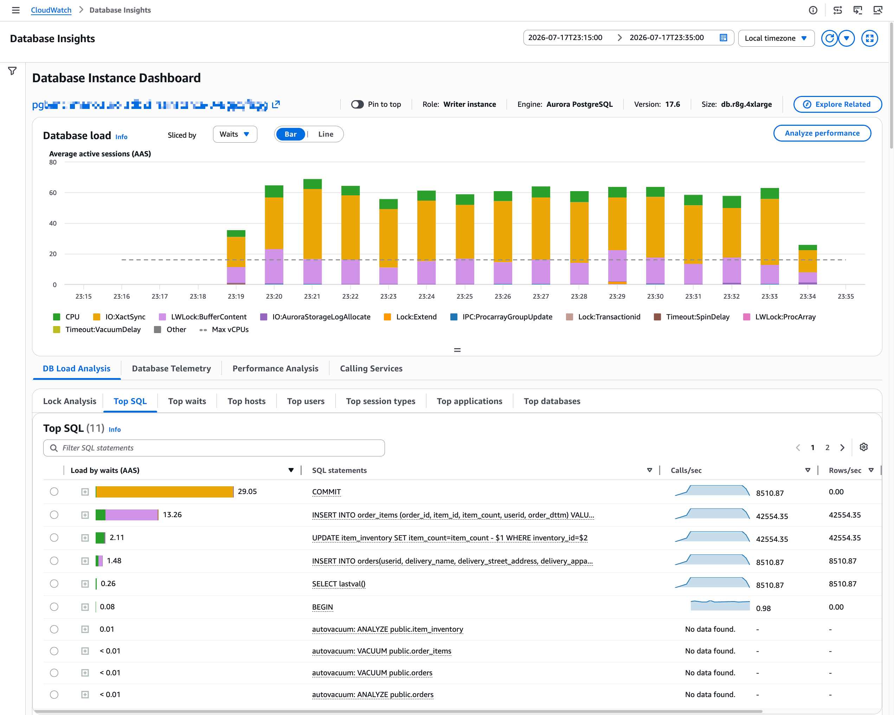
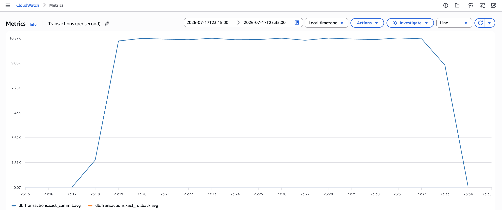
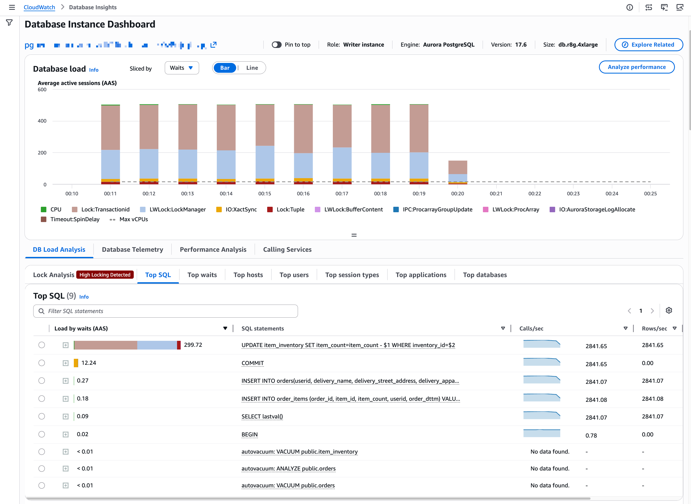
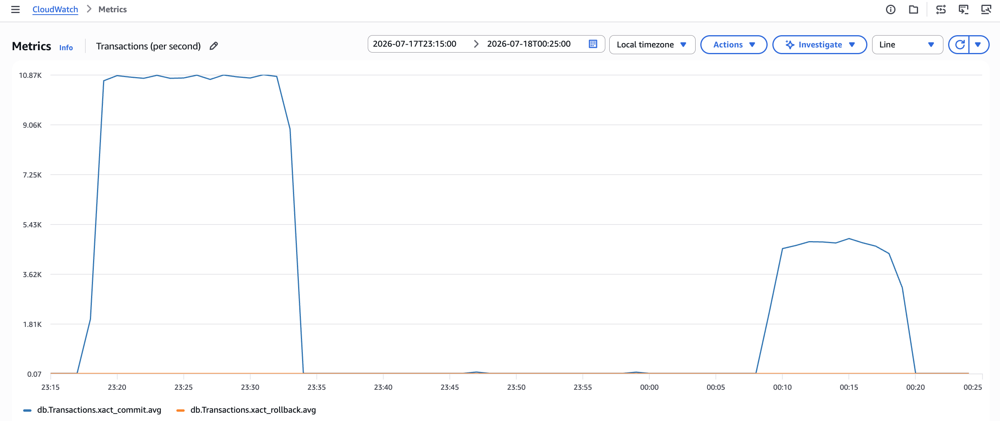
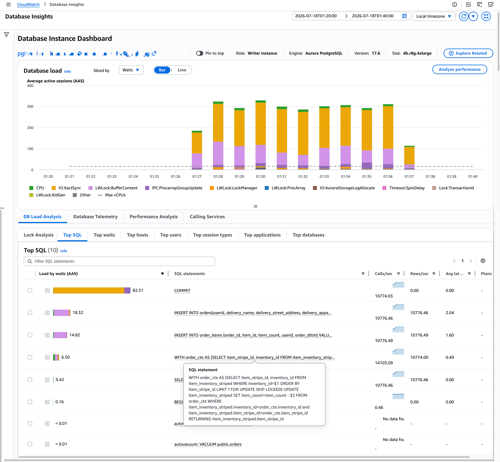
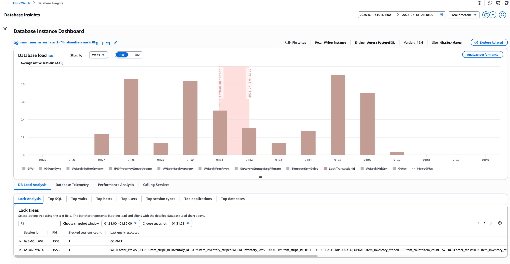
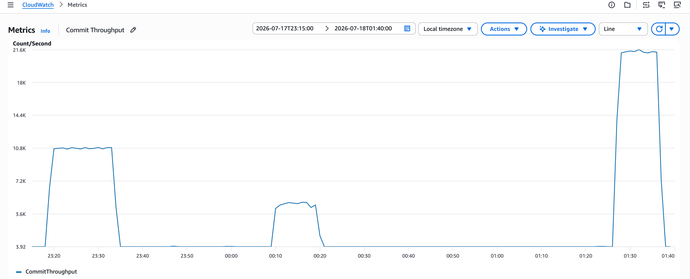

# Workload Simulation Scripts for Amazon RDS PostgreSQL and Amazon Aurora PostgreSQL-compatible Database

This repo uses [sysbench](https://github.com/akopytov/sysbench?tab=readme-ov-file#sysbench) to simulate an order-placement workload against Amazon RDS PostgreSQL or Amazon Aurora PostgreSQL.

> **⚠️ Not for production.** This repository is a sample for demonstrating and studying database lock contention. The CloudFormation templates and scripts here are a minimal setup for reproducing that behavior — they are not a hardened reference architecture. Before adapting any part of this for production use, review [Section 3.8](#38-security-considerations) below and add the additional hardening it describes.

> **📌 Production Note.** This template is only meant to demonstrate the workload simulation scenarios described in this repository. It is not meant for production deployment. Before you deploy a stack based on this template in production, we recommend following certain best practices, including:
> 1. **Enable deletion protection on the database, and switch the deletion policy on the database and KMS keys away from `Delete`.** Neither template enables [Amazon RDS/Aurora deletion protection](https://docs.aws.amazon.com/AmazonRDS/latest/UserGuide/USER_DeleteInstance.html) (`DeletionProtection`), and both set `DeletionPolicy: Delete` on the database and KMS key resources (rather than CloudFormation's usual `Snapshot` default for RDS/Aurora). This is intentional for this sample: it lets `aws cloudformation delete-stack` (or deleting the stack from the console) tear everything down in one step, with no final snapshot left behind to clean up separately — see Section 2.9 for cleanup instructions. For a production database:
>    - Set **`DeletionProtection: true`** on the `AWS::RDS::DBCluster`/`AWS::RDS::DBInstance` resource, so it can't be deleted — accidentally or otherwise — without first explicitly disabling protection.
>    - Change **`DeletionPolicy`** from `Delete` to `Retain` or `Snapshot` on the DB resources *and* on the KMS keys (`AuroraKMSCMK`/`RDSKMSCMK`, `SecretsMgrKMSCMK`). Leaving the KMS keys on `Delete` means a stack deletion schedules the encryption key for deletion too — if that happens before any surviving snapshots/backups are migrated to a new key, they become permanently unreadable, independent of whatever deletion protection is set on the DB resource itself.

---

## 1. Purpose

This repository demonstrates **how row lock contention affects workload throughput**, and how you can reduce that contention. It sets up a small e-commerce style schema (`users`, `address`, `item_inventory`, `orders`, `order_items`), seeds it with data, and simulates order-placement traffic against it.

Placing an order decrements inventory for the items ordered. When many concurrent sessions try to buy the same small set of items (think of a **flash sale**), they all contend for the same `item_inventory` rows, and throughput collapses as writers queue up behind row locks.

The scripts let you simulate and compare a few traffic shapes:

- **Average load** — steady, low-contention writes spread across a large inventory.
- **Sporadic load** — average load with occasional random peak bursts (spikes).
- **Contentious load** — a high thread count concentrated on a handful of inventory rows, deliberately inducing lock contention (a flash-sale-like scenario).
- **Contentious load against striped inventory** — the same contentious traffic, but against an inventory that has been "striped" across multiple rows to reduce contention, so you can observe the improvement.

These scripts are for **simulating specific workload conditions** so you can observe and troubleshoot database behavior (e.g. with Amazon CloudWatch Database Insights). They are not a general-purpose benchmarking tool.

---

## 2. Quick start

The commands below use defaults and omit non-mandatory parameters wherever possible, to keep things simple and reduce the chance of errors.

### 2.1 Get an environment

Use **either** an existing database or the provided CloudFormation templates.

**Option A — use an existing Amazon Aurora or Amazon RDS cluster and EC2 client host.** You need a PostgreSQL-compatible database and a host that can reach it with `psql` and `sysbench` (built `--with-pgsql`) installed. See:

- [Creating and connecting to an Aurora PostgreSQL DB cluster](https://docs.aws.amazon.com/AmazonRDS/latest/AuroraUserGuide/CHAP_GettingStartedAurora.CreatingConnecting.AuroraPostgreSQL.html)
- [Creating an RDS PostgreSQL DB instance](https://docs.aws.amazon.com/AmazonRDS/latest/UserGuide/USER_CreateDBInstance.html)
- [Connecting to an RDS DB instance from an EC2 instance](https://docs.aws.amazon.com/AmazonRDS/latest/UserGuide/ec2-rds-connect.html)

**Option B — deploy with CloudFormation.** Launch whichever template matches your engine (`setup-rds-pgsql-cfn.yml` or `setup-aurora-pgsql-cfn.yml`). These templates create AWS resources that incur costs. The bastion host has no SSH access at all — no EC2 key pair, no inbound security group rule — so once the stack reaches `CREATE_COMPLETE`, connect using [AWS Systems Manager Session Manager](https://docs.aws.amazon.com/systems-manager/latest/userguide/session-manager.html) via one of the stack outputs:

- **`SessionMgrLink`** — open this URL to log into the AWS Management Console and connect straight to the bastion's Session Manager console.
- **`BastionConnectCommand`** — run this with the AWS CLI instead:

```bash
aws ssm start-session --target <bastion-instance-id> --region <region>
```

Session Manager connects you as `ssm-user` by default. Switch to `ec2-user` to reach the account that already has `psql`/`sysbench` built and `PGHOST`, `PGUSER`, `PGPASSWORD`, etc. exported in `~/.bash_profile`:

```bash
sudo su - ec2-user
```

The bastion's UserData only builds `psql`/`sysbench` from source — it does not clone this repository, so the schema, datagen scripts, and workload scripts referenced in the rest of this walkthrough (e.g. `./PostgreSQL/pgsql-db-setup.sql`) aren't on the instance yet. Since there's no SSH/`scp` access to copy files onto the bastion, clone this repo directly on the instance instead (the bastion's security group already allows outbound HTTPS/443, which is all `git clone` over `https://` needs):

```bash
git clone git@github.com:aws-samples/sample-aurora-rds-workload-simulation-script.git
cd sample-aurora-rds-workload-simulation-script
```

Run the remaining commands in this walkthrough from inside that cloned directory.

See [Section 3](#3-detailed-documentation) for full details on the templates.

### 2.2 Set environment variables

```bash
export PGHOST=<database-host-endpoint>
export PG_ADMIN_USER=<admin-user>
```

(Optional) create a dedicated user and database first, using your admin user:


```bash
read -s -p "Enter Password: " TEST_USER_PASSWD


export $TEST_USER_PASSWD


psql -h $PGHOST -U $PG_ADMIN_USER -d postgres -c "CREATE USER test_user PASSWORD '${TEST_USER_PASSWD}'"

psql -h $PGHOST $PG_ADMIN_USER -d postgres -c "CREATE DATABASE testdb"

echo \
   "GRANT CONNECT ON DATABASE testdb TO test_user;
   GRANT USAGE ON SCHEMA public TO test_user;
   GRANT CREATE ON SCHEMA public TO test_user;
   \q" | psql -h $PGHOST -U $PG_ADMIN_USER -d testdb 
```

> `CREATE ON SCHEMA public` is required, not optional: Section 2.3 runs `pgsql-db-setup.sql` as `test_user`, which `CREATE TABLE`s every table in the schema, and `copy_item_inventory_to_striped.sh` (Section 2.7) does the same for the striped-inventory tables on every invocation. Don't narrow this grant unless you also change who owns/creates those tables.

> Choose a strong, unique password for `<your-password>` — don't reuse this value across environments, and never commit real credentials to source control.

> All scripts in this repo default `-u`/`-d` to `test_user`/`testdb` when omitted, so you only need to pass `-u`/`-d` explicitly if you're using different credentials than the ones created above.

Set the environment variables `.bash_profile`:

```bash
echo "export TEST_USER_PASSWD=${TEST_USER_PASSWD}" >> ~/.bash_profile
echo "export PGUSER=test_user" >> ~/.bash_profile
echo "export PGDATABASE=testdb" >> ~/.bash_profile
source ~/.bash_profile
```

### 2.3 Create the schema

```bash
export PGPASSWORD=$TEST_USER_PASSWD
psql -h $PGHOST -U $PGUSER -d $PGDATABASE -f ./PostgreSQL/pgsql-db-setup.sql
```

### 2.4 Load data

Seed `item_inventory`, `users`, and `address` with defaults:

```bash
chmod 0700 ./PostgreSQL/datagen-scripts/refresh_db.sh
./PostgreSQL/datagen-scripts/refresh_db.sh -u $PGUSER -h $PGHOST -d $PGDATABASE \
  -f item_inventory_batched_inserts.lua -b users,address
```

### 2.5 Run an average load

Steady, low-contention writes spread across a large inventory range:

```bash
chmod 0700 ./PostgreSQL/workload-scripts/simulate_avg_load.sh

./PostgreSQL/workload-scripts/simulate_avg_load.sh -h "$PGHOST" -u $PGUSER -d $PGDATABASE
```

With 256 concurrent requests spread across a large inventory range, this establishes a healthy baseline throughput. If you check CloudWatch Database Insights while this is running, `COMMIT` typically shows up as the top SQL, and wait events stay low — a sign the database isn't waiting on locks:





### 2.6 Run a contentious load

A high thread count concentrated on a handful of inventory rows — the flash-sale scenario. Watch throughput and lock waits here compared to the average load:

```bash
chmod 0700 ./PostgreSQL/workload-scripts/simulate_contentious_load.sh
./PostgreSQL/workload-scripts/simulate_contentious_load.sh -h "$PGHOST" -u $PGUSER -d $PGDATABASE
```

Now increase concurrency to 512 requests, most of them concentrated on a handful of items — similar to a flash sale. Throughput degrades, and this time lock contention rises to the top of CloudWatch Database Insights instead of `COMMIT`:






The sysbench may fail with an error similar to:

```
(last message repeated 1 times)
FATAL: `thread_init' function failed: place_order_writes_only_optimized.lua:160: connection creation failed
(last message repeated 1 times)
FATAL: Connection to database failed: could not translate host name "pgbenchmark-aurora-pg-cluster-io-opt.cluster-xxxxxxxxxxxx.ap-southeast-1.rds.amazonaws.com" to address: Name or service not known
```

This failure is due to throttling during DNS name resolution when sysbench thread init process tries to establish connection to the database using DNS name. You can retry a few times. To completely avoid the issue, you can implement DNS cache using systemd-resolved and dnsmasq.

### 2.7 Stripe the inventory to reduce contention

Instead of every buyer updating the same single row for a hot item, we "stripe" each item's inventory count across multiple rows. Writers then pick one stripe row at a time (using `FOR UPDATE SKIP LOCKED`), so concurrent updates for the same item spread across several rows rather than serializing on one.

Create the striped tables (`item_inventory_striped` and `item_inventory_striping_config`) from your existing `item_inventory` data:

```bash
chmod 0700 ./PostgreSQL/datagen-scripts/copy_item_inventory_to_striped.sh
./PostgreSQL/datagen-scripts/copy_item_inventory_to_striped.sh -h "$PGHOST" -u $PGUSER -d $PGDATABASE
```

By default each item is split into **20 stripes**. A **higher striping factor gives writers more rows to spread across, reducing the chance of collision** (two sessions fighting for the same stripe). You can raise it with `-n` — see [Section 3.5](#35-striping--copy_item_inventory_to_stripedsh) for details.

### 2.8 Run a contentious load against the striped inventory

```bash
chmod 0700 ./PostgreSQL/workload-scripts/simulate_contentious_load_with_striped_inventory.sh
./PostgreSQL/workload-scripts/simulate_contentious_load_with_striped_inventory.sh -h "$PGHOST" -u $PGUSER -d $PGDATABASE
```

This runs the same flash-sale-style traffic, but against the striped tables. Because a writer might pick a stripe row that another session already holds a lock on, the workload **retries** the inventory update (up to 25 times) on that item, skipping locked stripes.

With inventory striped, the workload can absorb the same increase in concurrency and the same contentious access pattern that degraded throughput in step 2.6 — writes for a hot item now spread across multiple stripe rows instead of serializing on one, so lock waits drop and throughput recovers:







When the run finishes, the script prints an inventory retry summary alongside the sysbench results:

```
Inventory update retry summary (from .../inventory_stats_<timestamp>.csv):
    total retries:                       <n>
    total failures (after max retries):  <n>
    total items processed:               <n>
```

- **retries** — how often a writer had to try another stripe because its first pick was locked.
- **failures** — update attempts that never found a free stripe even after 25 attempts.
- **items processed** — items whose inventory was successfully decremented.

If you see **too many failures**, that's a signal to **use a bigger striping factor** (re-run step 2.7 with a larger `-n`), giving writers more stripes to spread across.

**A note on the striping approach:** our `copy_item_inventory_to_striped.sh` does **fair striping** — it applies the *same* stripe count to every item. Real workloads are rarely uniform: a few hot items need many stripes while most need none. You could implement a more sophisticated scheme that assigns stripe counts per item based on popularity. If you do, you have two design choices:

1. **Stripe-count-aware** — the writer first looks up how many stripes a given item has (from `item_inventory_striping_config`), then picks one, e.g. at random within that range.
2. **Stripe-count-agnostic** — the writer doesn't need to know the stripe count at all; it just asks for the next available (unlocked) stripe for the item.

Each choice requires modeling the update query differently. The query in `place_order_optimized_and_reduced_contention.lua` is **agnostic** to the number of stripes — it uses `... ORDER BY item_stripe_id LIMIT 1 FOR UPDATE SKIP LOCKED` to grab whatever stripe row is free, without ever reading the stripe count.

### 2.9 Clean up

When you're done experimenting, clean up the resources you created so they stop contributing to your AWS bill. Retaining a database cluster, EC2 instance, or Advanced mode Database Insights beyond what you need will continue to incur charges.

- **If you used the CloudFormation template** (`setup-rds-pgsql-cfn.yml` or `setup-aurora-pgsql-cfn.yml`), the simplest cleanup is to [delete the stack](https://docs.aws.amazon.com/AWSCloudFormation/latest/UserGuide/cfn-console-delete-stack.html). This removes the EC2 client host, database instance/cluster, and other resources the template created, in one step.
- **If you created a new EC2 instance** outside of CloudFormation to run the workload scripts, it will continue to incur cost while running. Check the instance's [EBS volume persistence settings](https://docs.aws.amazon.com/AWSEC2/latest/UserGuide/preserving-volumes-on-termination.html#check-ebs-volume-persistence-settings) to understand whether its volumes are deleted automatically on termination, then [terminate the instance](https://docs.aws.amazon.com/AWSEC2/latest/UserGuide/terminating-instances.html). If any volumes are retained, [delete them separately](https://docs.aws.amazon.com/prescriptive-guidance/latest/optimize-costs-microsoft-workloads/ebs-delete-ebs-volumes.html).
- **If you created a new Amazon Aurora cluster** to run these simulations, [delete each DB instance in the cluster](https://docs.aws.amazon.com/AmazonRDS/latest/AuroraUserGuide/USER_DeleteCluster.html#USER_DeleteInstance) first, then [delete the cluster itself](https://docs.aws.amazon.com/AmazonRDS/latest/AuroraUserGuide/USER_DeleteCluster.html#USER_DeleteCluster.DeleteCluster).
- **If you enabled CloudWatch Database Insights Advanced mode** on an existing cluster to follow along with lock analysis, Advanced mode and its retention period continue to incur charges until you turn it off. You can [switch back to Standard mode](https://docs.aws.amazon.com/AmazonRDS/latest/UserGuide/USER_DatabaseInsights.TurningOnStandard.html) if you no longer need it — though for production workloads, we recommend keeping Advanced mode enabled.

---

## 3. Detailed documentation

### 3.1 Repo layout

```
PostgreSQL/
├── pgsql-db-setup.sql              Schema DDL for the order-placement tables (incl. striped tables)
├── setup-rds-pgsql-cfn.yml         Optional CloudFormation: RDS PostgreSQL instance + EC2 client host
├── setup-aurora-pgsql-cfn.yml      Optional CloudFormation: Aurora PostgreSQL cluster + EC2 client host
├── datagen-scripts/
│   ├── refresh_db.sh               Generic sysbench data-load wrapper script
│   ├── users.lua                   Seeds the users table
│   ├── address.lua                 Seeds the address table
│   ├── item_inventory_batched_inserts.lua   Seeds item_inventory (batched inserts)
│   └── copy_item_inventory_to_striped.sh    Builds the striped inventory tables from item_inventory
└── workload-scripts/
    ├── place_order_writes_only_optimized.lua            Order-placement workload (single inventory row per item)
    ├── place_order_optimized_and_reduced_contention.lua Order-placement workload (striped inventory + SKIP LOCKED + retries)
    ├── simulate_avg_load.sh                             Steady, low-contention write load
    ├── simulate_contentious_load.sh                     High-contention write load (flash sale)
    ├── simulate_contentious_load_with_striped_inventory.sh  High-contention load against striped inventory
    └── simulate_sporadic_workload.sh                    Average load with occasional random peak bursts
```

### 3.2 CloudFormation templates

Each template creates:

- A VPC with public and private subnets across multiple AZs, an Internet Gateway, and a NAT Gateway
- The Amazon RDS instance (Multi-AZ) or Amazon Aurora cluster (1 writer + 1 reader), encrypted, with CloudWatch Database Insights and Enhanced Monitoring enabled
- An EC2 bastion/client host in the public subnet, with security groups restricting DB access to that host
- A Secrets Manager secret holding the generated DB admin credentials
- IAM roles/instance profile for the EC2 host (SSM access + permission to read the DB secret and describe the DB resources)

The EC2 host's user data script installs build tools, builds `psql` and `sysbench` (with PostgreSQL support) from source, and configures `PGHOST` (and `PGHOST_RR` for the Amazon Aurora reader endpoint), `PGUSER`, `PGPASSWORD`, and a `.pgpass` file. **It does not create the schema, seed data, or run any workload** — you do that with the steps in Section 2.

### 3.3 Schema

`pgsql-db-setup.sql` creates the order-placement tables (`users`, `address`, `item_category`, `item_inventory`, `orders`, `order_items`) plus the two striped-inventory tables:

- `item_inventory_striped` — one item spread across multiple rows, each identified by `(inventory_id, item_stripe_id)`.
- `item_inventory_striping_config` — records how many stripes each `inventory_id` was split into.

There are intentionally **no foreign key constraints**: FK enforcement adds its own locking and I/O that would mask the specific contention patterns these simulations are meant to surface. For any production schema derived from this one, add foreign keys.

### 3.4 Data loading — `refresh_db.sh`

Wraps sysbench to load data into a table using its corresponding `.lua` script. Run from the repo root or from `datagen-scripts/`.

Options:

- `-f <file.lua>`: Lua script to run (required unless `-b` is used)
- `-b <table1,table2,...>`: Comma-separated list of tables to seed; looks for `<table>.lua` in the current directory
- `-u <username>`: PostgreSQL username (default: `postgres`)
- `-d <database>`: PostgreSQL database name (default: `postgres`)
- `-h <host>`: PostgreSQL host endpoint (required)
- `-p <port>`: PostgreSQL port (default: `5432`)
- `-e <sysbench events>`: Number of events for sysbench (default: `1000`)
- `-t <sysbench threads>`: Number of threads (default: `100`)
- `-w <password>`: PostgreSQL password. **Prefer setting `PGPASSWORD` in the environment instead** — `-w` is visible to other users via `/proc/<pid>/cmdline` and may end up in shell history. Falls back to `$PGPASSWORD` if `-w` isn't given.
- `-E <table1=events1,...>`: Override the event count for specific tables
- `-O <script1.lua='--option-name:value',...>`: Pass additional Lua script options (e.g. `batch_size` for `item_inventory_batched_inserts.lua`, or `users_count` for `address.lua`)

After loading, the script runs `VACUUM`/`ANALYZE` on `item_inventory`, `orders`, and `order_items`.

Fully-parameterized example:

```bash
export DefaultDataLoadEventsCount=100000   # sysbench events for item_inventory batched inserts
export ItemsInsertBatchSize=1000           # rows inserted per item_inventory transaction
export SysbenchDataLoadThreads=64          # sysbench threads used for data loading
export UserCount=100000                    # rows to insert into users
export AddressCount=100000                 # rows to insert into address

cd datagen-scripts
./refresh_db.sh -u "$PGUSER" -d "$PGDATABASE" -h "$PGHOST" \
  -t "$SysbenchDataLoadThreads" -e "$DefaultDataLoadEventsCount" \
  -f item_inventory_batched_inserts.lua \
  -b users,address \
  -E users="$UserCount",address="$AddressCount" \
  -O address="--users_count:${UserCount}",item_inventory_batched_inserts="--batch_size:${ItemsInsertBatchSize}"
```

This inserts `UserCount` rows into `users`, `AddressCount` rows into `address`, and `ItemsInsertBatchSize * DefaultDataLoadEventsCount` rows into `item_inventory`.

### 3.5 Striping — `copy_item_inventory_to_striped.sh`

Copies `item_inventory` into `item_inventory_striped`, splitting each item's `item_count` across `<stripe_count>` rows, and (re)populates `item_inventory_striping_config`. Both tables are recreated from scratch on every run, so it's safe to re-run after `item_inventory` changes.

For an item with count `C` and `N` stripes: stripes `1..N-1` each get `floor(C / N)`, and the final stripe gets the remainder so the sum always equals `C`.

Options:

- `-h <host>`: PostgreSQL host endpoint (required)
- `-w <password>`: prefer `PGPASSWORD` env var (see note above)
- `-u <username>`: default `postgres`
- `-d <database>`: default `postgres`
- `-p <port>`: default `5432`
- `-n <stripe_count>`: number of stripe rows per item (default: `20`). **A higher value reduces the chance of collision** under contention.

Example using a larger striping factor of 50:

```bash
./PostgreSQL/datagen-scripts/copy_item_inventory_to_striped.sh -h "$PGHOST" -u $PGUSER -d $PGDATABASE -n 50
```

### 3.6 Workload scripts

All workload scripts accept `-w <password>` but fall back to `PGPASSWORD` — prefer the env var. Each writes a timestamped sysbench log under the output directory (default: `./output`).

#### `simulate_avg_load.sh` — steady, low-contention write load

Constant thread count against a large `item_inventory` range, so writes spread across many rows.

```bash
./PostgreSQL/workload-scripts/simulate_avg_load.sh -h "$PGHOST" -u $PGUSER -d $PGDATABASE -t 3300
```

Options: `-h` (required); optional `-u`, `-d`, `-p`, `-n <threads>`, `-t <run_time seconds>`, `-I <inventory_scale>`, `-U <user_scale>`, `-X <items_per_order>`, `-o <output_dir>`. Run with no arguments to see current defaults.

#### `simulate_contentious_load.sh` — high-contention write load (flash sale)

High thread count against a very small `item_inventory` range, concentrating writes on a handful of rows to induce row lock contention. Uses `place_order_writes_only_optimized.lua`, which updates a single `item_inventory` row per item.

```bash
./PostgreSQL/workload-scripts/simulate_contentious_load.sh -h "$PGHOST" -u $PGUSER -d $PGDATABASE
```

Options: `-h` (required); optional `-u`, `-d`, `-p`, `-n <threads>`, `-t <run_time seconds>`, `-I <inventory_scale>`, `-U <user_scale>`, `-X <items_per_order>`, `-o <output_dir>`. Run with no arguments to see current defaults.

#### `simulate_contentious_load_with_striped_inventory.sh` — contentious load, striped inventory

Same contentious traffic shape, but runs `place_order_optimized_and_reduced_contention.lua` against `item_inventory_striped`. **Run `copy_item_inventory_to_striped.sh` first.**

```bash
./PostgreSQL/workload-scripts/simulate_contentious_load_with_striped_inventory.sh -h "$PGHOST" -u $PGUSER -d $PGDATABASE
```

Same options as `simulate_contentious_load.sh`.

**Retry/failure logging.** The workload picks a stripe row with `FOR UPDATE SKIP LOCKED`; if all stripes for an item are locked, the update matches 0 rows, so the script retries (up to 25 attempts) before giving up on that item. Each thread tracks, in its own isolated Lua state (no cross-thread races):

- `total_retries` — every inventory update attempt beyond the first, across all items/orders.
- `total_failures` — update attempts that never succeeded after 25 attempts.
- `total_items_processed` — items whose inventory was successfully decremented.

On finishing, each thread appends one CSV row (`thread_id,total_retries,total_failures,total_items_processed`) to the file named in the `INVENTORY_STATS_LOG` environment variable (set by the shell script to `output/inventory_stats_<timestamp>.csv`). The shell script writes the CSV header before the run, then aggregates all rows into totals and appends the summary to the same sysbench log after the run.

When an item exhausts its 25 retries, the workload rolls back the current transaction and raises a `RESTART_EVENT`, which sysbench catches and uses to restart the whole order (new order, address, and cart) — the thread keeps running and the failed order's partial rows are not committed.

#### `simulate_sporadic_workload.sh` — average load with occasional peak bursts

Runs average-load traffic continuously, and periodically (based on a configurable probability and cool-off period) ramps threads up through a peak burst before returning to average load. Runs until interrupted (Ctrl+C).

```bash
./simulate_sporadic_workload.sh -h "$PGHOST" -w "$PGPASSWORD" -d testdb -u test_user \
  -N 4 -t 1800 -m 8 -M 256 -T 900 -P 10 -c 600 -C 7200 -r 180
```

Key options:
- `-N <threads>` / `-t <run_time>`: average load thread count and duration
- `-m <min_threads>` / `-M <max_threads>` / `-T <run_time>`: peak load thread range and duration
- `-P <probability>`: chance (0-100) of triggering a peak burst each cycle
- `-c <cool_off>`: pause between cycles
- `-C <cool_off>`: minimum gap between two peak bursts
- `-R <strategy>` / `-r <run_time>`: thread rampup strategy (`exponential`/`linear`) and time at each rampup step
- `-o <output_dir>`: where logs and `summary_writes.csv` are written (default: `./output`)

The script truncates `orders`/`order_items` and vacuums `item_inventory` between cycles, so re-running data generation isn't needed between runs.

### 3.7 Adding new workloads

The repo is structured so additional workload `.lua` scripts and their `simulate_*.sh` runners can be added under `workload-scripts/` following the same pattern: host/credentials/threads as flags, no hardcoded values, basic input validation, and error handling.

### 3.8 Security considerations

This repo is a workload simulation sample, not a hardened reference architecture. It already includes some security-conscious defaults — encrypted storage (including the bastion's EBS root volume), Secrets Manager-generated admin credentials, `test_user` scoped to `testdb` for running the workloads, security groups that restrict inbound DB access to the bastion host only, and least-privilege KMS key policies. Before adapting any part of this for production, review and add:

- **Secrets Manager rotation** — disabled here for simplicity (both templates leave `PgSQLsecretAdminUser` without `RotationRules`, and each `AWS::SecretsManager::Secret` resource carries a `PRODUCTION NOTE` comment calling this out). Production should enable automatic rotation (e.g. via the RDS/Aurora-native rotation Lambda) and rotate the DB admin credential on a schedule — AWS recommends at minimum every 30 days — so a leaked credential doesn't remain valid indefinitely.
- **TLS enforcement for PostgreSQL connections** — both templates now set `rds.force_ssl: 1` on their DB parameter group, and the bastion's UserData exports `PGSSLMODE=require` alongside `PGHOST`, so connections from the bastion (and from `sysbench`, which reads `PGSSLMODE` via libpq) are rejected if they don't negotiate TLS. For stronger certificate validation in production, use `PGSSLMODE=verify-full` with the [RDS CA certificate bundle](https://docs.aws.amazon.com/AmazonRDS/latest/UserGuide/UsingWithRDS.SSL.html) instead.
- **IAM database authentication** — enabled on the DB cluster/instance (`EnableIAMDatabaseAuthentication: true`) but not actually used by any script; all scripts here authenticate with the Secrets Manager password. **This is left open intentionally, not as an oversight.** Anyone who reaches the bastion (via Session Manager) can already use its IAM role to authenticate, so switching to IAM database auth doesn't remove that access path on its own — it just changes the credential type. Actually closing that gap needs per-user identity (e.g. AWS IAM Identity Center mapped to individual `rds-db:connect` grants), which is a meaningfully bigger change than this sample's scope, and isn't needed for non-production use. If you adapt this for a shared or longer-lived environment, that's the place to start.
- **Bastion host hardening** — the bastion has no SSH access at all: no EC2 key pair is created or attached, and the security group has no inbound rules of any kind. The only way to reach it is [AWS Systems Manager Session Manager](https://docs.aws.amazon.com/systems-manager/latest/userguide/session-manager.html) (already configured via `AmazonSSMManagedInstanceCore` + the SSM Agent in UserData), which needs no open inbound port since it's initiated outbound over HTTPS. For production-adjacent use, still add patching automation and session logging on top of this.
- **Bastion EBS root volume encryption** — the bastion's root volume is encrypted with a dedicated customer-managed KMS key (`EbsKMSCMK`), not the account's default `aws/ebs` key, via `BlockDeviceMappings` on the `bastionHost` resource. This protects the DB admin credential and IAM instance-profile temporary credentials that are staged on disk (`~/.bash_profile`, `~/.pgpass`) if the volume were ever copied out via snapshot or AMI. Note that decryption at launch is authorized to whichever IAM identity runs `aws cloudformation deploy`/`create-stack` (via a [Forward Access Session](https://docs.aws.amazon.com/IAM/latest/UserGuide/access_forward_access_sessions.html)), not to the bastion's own `roleBastionHost` — EC2 issues the KMS grant needed to attach an encrypted volume to a separate, AWS-managed identity-only role scoped to that instance, so no extra KMS permissions are needed on `roleBastionHost` itself. See [Requirements for Amazon EBS encryption](https://docs.aws.amazon.com/ebs/latest/userguide/ebs-encryption-requirements.html).
- **Network egress** — both CloudFormation templates scope the bastion host's outbound traffic to HTTPS (443), DNS (53), and PostgreSQL (5432, to the DB security group only) rather than allow-all, since the bastion's UserData script only needs those to build `psql`/`sysbench` from source and reach AWS APIs. The DB's own security group has no egress at all (a loopback-only placeholder), since RDS/Aurora control-plane calls to Secrets Manager/CloudWatch happen outside the instance's own network path. If you extend the bastion's UserData script to reach additional endpoints, revisit these rules.
- **KMS key administration** — both templates grant the account root broad key-administration actions (`kms:Create*`, `kms:Put*`, etc.) scoped to key lifecycle management, not data-plane `Encrypt`/`Decrypt`. The data-plane grant (also to the account-root principal, not a service principal) is scoped with `kms:ViaService` (`rds.<region>.amazonaws.com` / `secretsmanager.<region>.amazonaws.com`) plus `kms:CallerAccount`, so RDS/Aurora and Secrets Manager can only use the key via a [Forward Access Session](https://docs.aws.amazon.com/IAM/latest/UserGuide/access_forward_access_sessions.html) on behalf of an IAM identity already in this account. A `Service:` principal here (e.g. `rds.amazonaws.com`) doesn't work for FAS calls and fails stack creation with `Access to KMS is not allowed`. For production, consider narrowing the root statement further to specific IAM roles/users rather than the account root.
- **Password strength** — if you follow the manual setup path (Section 2.2) and choose your own `<your-password>`, use a strong, unique value (16+ characters), distinct from any password used in other environments, and never commit it to source control. The CloudFormation path avoids this entirely by auto-generating a 24-character password via Secrets Manager.
- **Out of scope** — Multi-region/DR, WAF, and centralized logging are not addressed by these templates; they're outside the scope of a workload simulation sample but worth adding for any production-adjacent deployment.
